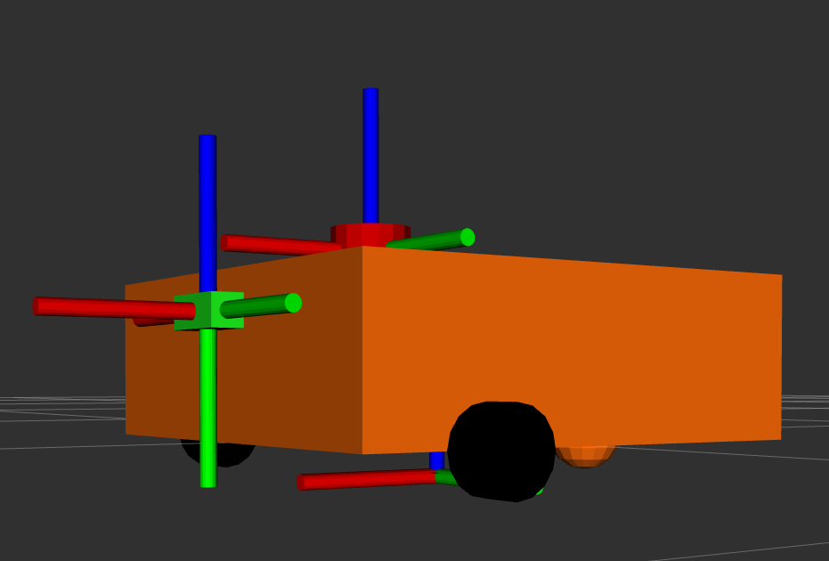
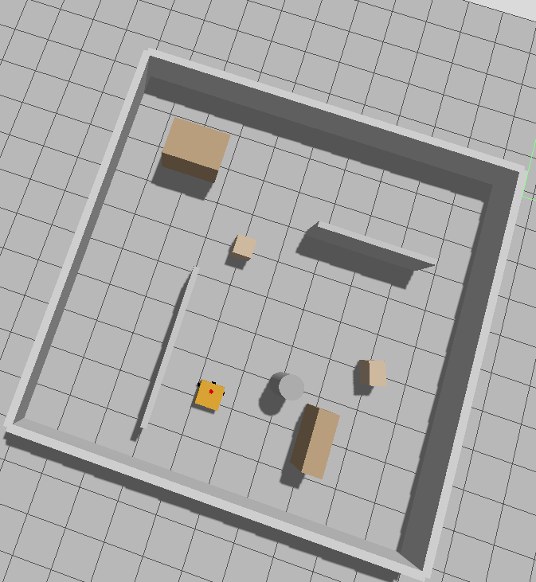
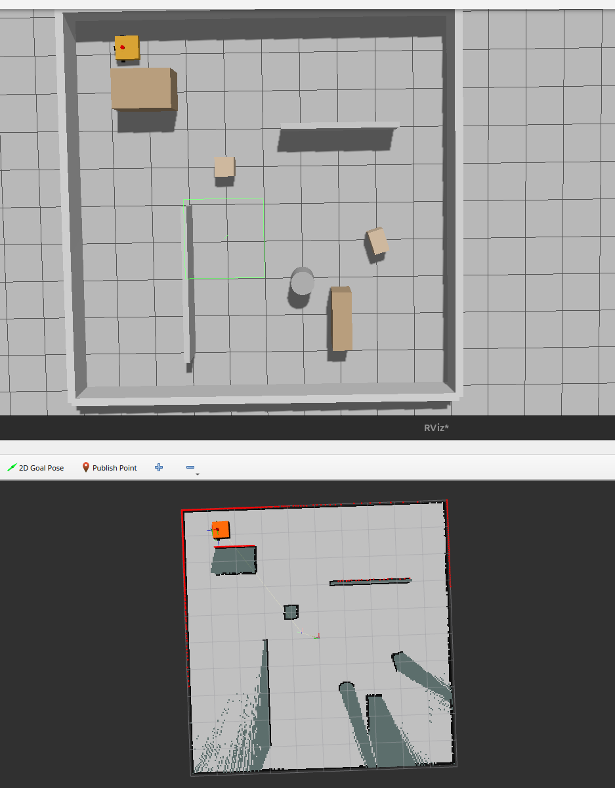
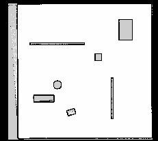
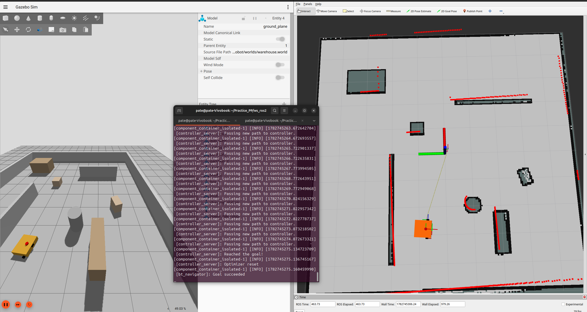

# Бортовой журнал проекта

## Глава 0: Об системе
1) OS: Linux Ubuntu 24.04.2 LTS

2) дистрибутив ROS 2: ROS 2 Jazzy


## Глава 1: ROS2 пакеты

Я выбрал для проекты следующие пакеты:

###  Симуляция и окружение (Gazebo)

Эта группа обеспечивает связь ROS 2 с симулятором Gazebo Harmonic.

*   **`ros-jazzy-ros-gz`**: Мета-пакет, который устанавливает все необходимые компоненты для интеграции ROS 2 и Gazebo.
*   **`ros-jazzy-ros-gz-sim`**: Содержит удобные launch-файлы и утилиты для запуска Gazebo Sim из ROS 2.
*   **`ros-jazzy-ros-gz-bridge`**: Обеспечивает двунаправленный обмен данными (топики, сервисы, действия) между ROS 2 и Gazebo Transport.
*   **`ros-jazzy-ros-gz-image`**: Специализированный мост для передачи изображений из Gazebo в ROS 2 с использованием `image_transport`.

### Навигация и картографирование (Nav2)

Основа для автономного перемещения робота.

*   **`ros-jazzy-navigation2`**: Основной пакет со стеком навигации Nav2.
*   **`ros-jazzy-nav2-bringup`**: Содержит launch-файлы и конфигурации для быстрого запуска Nav2.
*   **`ros-jazzy-slam-toolbox`**: Инструмент для создания карт (SLAM) в режиме реального времени.

###  Управление роботом (ROS 2 Control)

Данные пакеты нужны для управления аппаратной частью  робота в симуляции.

*   **`ros-jazzy-ros2-control`**: Основной фреймворк для управления роботами в ROS 2.
*   **`ros-jazzy-ros2-controllers`**: Набор стандартных контроллеров, включая:
    *   **`diff_drive_controller`**: Контроллер для роботов с дифференциальным приводом.
    *   **`joint_state_broadcaster`**: Публикует состояние всех сочленений робота.
*   **`ros-jazzy-robot-state-publisher`**: Публикует состояние робота (TF-трансформы) на основе URDF.
*   **`ros-jazzy-xacro`**: Утилита для работы с макросами в URDF-файлах, упрощает описание робота.

### Поведенческие деревья (Behavior Trees)

Для реализации сложной логики, например, автоматической парковки.

*   **`ros-jazzy-py-trees-ros`**: Реализация поведенческих деревьев на Python, интегрированная с ROS 2.

###  Детектирование AprilTag (для расширенной стыковки)

Для точной навигации на финальном этапе парковки. 

*   **`ros-jazzy-apriltag-detector`**: Базовый пакет с интерфейсами для детекторов AprilTag.
*   **`ros-jazzy-apriltag-detector-mit`**: Плагин с реализацией детектора от MIT.

###  Вспомогательные и отладочные инструменты

*   **`ros-jazzy-rviz2`**: Основной инструмент для 3D-визуализации данных.
*   **`ros-jazzy-teleop-twist-keyboard`**: Позволяет управлять роботом с клавиатуры для ручного тестирования.
*   **`ros-jazzy-joy`**: Поддержка джойстика для управления роботом.

---

### Итоговая команда для установки

Можно установить все перечисленные пакеты одной командой:

```bash
sudo apt update
sudo apt install ros-jazzy-ros-gz ros-jazzy-ros-gz-sim ros-jazzy-ros-gz-bridge ros-jazzy-ros-gz-image \
ros-jazzy-navigation2 ros-jazzy-nav2-bringup ros-jazzy-slam-toolbox \
ros-jazzy-ros2-control ros-jazzy-ros2-controllers ros-jazzy-robot-state-publisher ros-jazzy-xacro \
ros-jazzy-py-trees-ros ros-jazzy-behaviortree-cpp-v3 \
ros-jazzy-apriltag-detector ros-jazzy-apriltag-detector-mit \
ros-jazzy-rviz2 ros-jazzy-teleop-twist-keyboard ros-jazzy-joy
```


## Глава 2: Создания новых пакетов

Для проект создадим новый пакет, который будет называться "power_nav_robot":

```bash
cd ~/ros2_ws/src
ros2 pkg create power_nav_robot --build-type ament_python --license Apache-2.0 --dependencies rclpy std_msgs geometry_msgs nav2_msgs sensor_msgs cv_bridge
```

Что мы добавили в зависимости:

- `rclpy` — для Python-нод.

- `std_msgs`, `geometry_msgs` — базовые сообщения.

- `nav2_msgs` — для работы с Nav2 (действия и сообщения).

- `sensor_msgs` — для работы с лидаром и камерой.

- `cv_bridge` — для обработки изображений (пригодится для AprilTag).


После создания пакета добавьте в него нужные директории:
```bash
cd ~/ros2_ws/src/power_nav_robot
mkdir -p launch config urdf worlds scripts rviz maps
```

Не забываем после каждого изменеия пересобирать:
```bash
cd ~/ros2_ws
colcon build
source install/setup.bash
```

## Глава 3: Описание модели робота и настройка окружения

Приступаем к созданию модели колесного мобильного робота с дифференциальным приводом, оснащенного лидаром и камерой. Процесс описания и настройки разделен на несколько этапов.

#### 1. Геометрическое и физическое описание (URDF/XACRO)

Для описания кинематики, геометрии и физики робота в папке `/urdf` создаются следующие файлы:

* `materials.xacro` — задает цветовые палитры (материалы) для визуального отображения элементов робота в симуляторе и RViz.
* `inertial.xacro` — содержит макросы для расчета массы и тензоров инерции базовых геометрических фигур. Это критически важно для корректной работы физического движка Gazebo.
* `wheel.xacro` — макрос, описывающий ведущее колесо (визуал, коллизии, инерция и сустав). Использование макроса позволяет избежать дублирования кода для левого и правого колеса.
* `robot_model.xacro` — главный сборочный файл. Объединяет базу, колеса и сенсоры в единую модель, а также описывает аппаратный интерфейс <ros2_control> для управления приводами.
* `robot_model.gazebo` — содержит специфичные для Gazebo Harmonic плагины: подключение сенсоров (лидар, камера) и плагин gz_ros2_control для связи физики симулятора с контроллерами ROS 2.

### 2. Настройка сборки и зависимостей пакета

Для корректной сборки и установки пакета обязательно корректируются корневые файлы:

* `setup.py` — скрипт сборки Python-пакета. В него добавляются инструкции (data_files) для копирования папок launch, urdf, config и worlds в системную директорию ROS 2 при выполнении colcon build.
* `package.xml` — манифест пакета, в котором прописаны все необходимые зависимости для работы проекта (ros-gz, ros2-control, nav2, xacro и др.).

3. Конфигурация управления и связи

В папке конфигурации `/config` создаются YAML-файлы для настройки стека управления и обмена данными:

* `diff_control.yaml` — конфигурация для фреймворка ros2_control. Настраивает менеджер контроллеров, публикует состояния суставов (joint_state_broadcaster) и задает параметры дифференциального привода (diff_drive_controller), включая кинематику (ширина колеи, радиус колес) и лимиты скоростей.
* `ros_gz_bridge.yaml` — конфигурация моста ros_gz_bridge. Задает правила двустороннего преобразования топиков между Gazebo Transport (время, данные лидара, изображение с камеры) и стандартными топиками ROS 2.

### 4. Визуализация модели

Для быстрой проверки URDF без запуска тяжелого симулятора Gazebo, в папке /launch создается файл:
- `view_robot.launch.py` — запускает ноду robot_state_publisher (для публикации TF-трансформаций и описания робота), joint_state_publisher_gui (для ручного управления суставами через графические ползунки) и RViz2 для интерактивного 3D-отображения модели.

Запуск визуалмзации: 
```bash
ros2 launch power_nav_robot view_robot.launch.py
```

Когда октрывается Rviz2, то чтобы появилмсь элементы (робот, TF и др.) назымаем `Add`! 

После добавления необходимого, сохраняем `rviz.rviz` в папку `/rviz`


<!--  -->

<!-- <div align="center">
  <figure>
    
    <figcaption><i>Рис. 1 — Вид робота в интерфейсе Rviz2</i></figcaption>
  </figure>
</div> -->

<div align="center">
  
  <p><i>Рис. 1 — Вид робота в интерфейсе Rviz2</i></p>
</div>


После написанмя кодов и до запуска не забываем про сборку: 
```bash
cd ~/ros2_ws
colcon build
source install/setup.bash
```


## Глава 4: Создания мира

В папке `/worlds` лежит созданный мир "камерный склад" в файле `warehouse.world`. Для проверки работоспособностм робота в данном мире в папке `/launch` была создана ещё одна программа `Sim_start_key.launch.py`, которая ставить робота в мир.  

Мир представляет собой помещение размером 10×10 метров, ограниченное четырьмя внешними стенами. Внутри расположены две внутренние перегородки, формирующие коридоры, два стеллажа, две коробки и колонна — это создаёт реалистичную среду для тестирования навигации и алгоритмов избегания препятствий.


<div align="center">
  
  <p><i>Рис. 2 —  Робот и мир в Gazebo  </i></p>
</div>


## Глава 5: Ручное управление роботом с клавиатуры

### 5.1. Цель этапа

Для дальнейшего тестирования навигации и построения карты необходимо проверить работоспособность робота при ручном управлении с клавиатуры оператора. Это позволяет убедиться, что:
- Мост `ros_gz_bridge` корректно передаёт команды между ROS 2 и Gazebo
- Плагин дифференциального привода правильно обрабатывает команды скорости
- Робот физически реагирует на команды (колёса крутятся, робот движется)

### 5.2. Используемые инструменты

Для ручного управления используется стандартный пакет **`teleop_twist_keyboard`**, который:
- Слушает нажатия клавиш в терминале
- Преобразует их в сообщения типа `geometry_msgs/msg/Twist`
- Публикует команды в топик `/cmd_vel`

Управление роботом реализовано через встроенный плагин Gazebo **`gz::sim::systems::DiffDrive`**, подключённый в файле `robot_model.gazebo`.

### 5.3. Архитектура управления

Плагин `DiffDrive` выполняет следующие функции:
- Подписывается на топик `/cmd_vel`
- Автоматически выполняет расчёт дифференциальной кинематики
- Публикует одометрию в топик `/odom`
- Строит TF-трансформации между фреймами `odom` и `base_link`

**Формулы дифференциальной кинематики:**

Скорости левого и правого колеса рассчитываются по формулам:

$$v_{left} = \frac{V - \omega \cdot \frac{L}{2}}{R}$$

$$v_{right} = \frac{V + \omega \cdot \frac{L}{2}}{R}$$

где:
- $V$ — линейная скорость робота (м/с)
- $\omega$ — угловая скорость робота (рад/с)
- $L$ — расстояние между колёсами (0.65 м)
- $R$ — радиус колеса (0.05 м)

### 5.4. Маршрут передачи команд

Связка топиков между ROS 2 и Gazebo обеспечивается через `ros_gz_bridge`:

```
┌──────────────────┐
│   Клавиатура     │
└────────┬─────────┘
         │
         ▼
┌──────────────────────────────────┐
│ teleop_twist_keyboard            │
│ (ROS 2 нода)                     │
└────────┬─────────────────────────┘
         │ публикует Twist
         ▼
┌──────────────────────────────────┐
│ /cmd_vel (ROS 2 топик)           │
└────────┬─────────────────────────┘
         │
         ▼
┌──────────────────────────────────┐
│ ros_gz_bridge                    │
│ (конвертация Twist → gz.msgs.    │
│ Twist)                           │
└────────┬─────────────────────────┘
         │
         ▼
┌──────────────────────────────────┐
│ /cmd_vel (Gazebo топик)          │
└────────┬─────────────────────────┘
         │
         ▼
┌──────────────────────────────────┐
│ DiffDrive плагин                 │
│ - расчёт кинематики              │
│ - управление суставами           │
└────────┬─────────────────────────┘
         │
         ▼
┌──────────────────────────────────┐
│ Колёса робота в Gazebo           │
└──────────────────────────────────┘
```

### 5.5. Запуск и проверка

**Запуск симуляции:**
```bash
cd ~/ros2_ws
colcon build
source install/setup.bash
ros2 launch power_nav_robot Sim_start_key.launch.py
```

**Запуск управления с клавиатуры (в новом терминале):**
```bash
ros2 run teleop_twist_keyboard teleop_twist_keyboard
```

**Управление:**
| Клавиша | Действие |
|---------|----------|
| `i` | Движение вперёд |
| `,` | Движение назад |
| `j` | Поворот влево |
| `l` | Поворот вправо |
| `k` | Остановка |
| `q`/`z` | Увеличить/уменьшить скорость |

### 5.6. Диагностика

Для проверки работоспособности использовались следующие команды:

**Просмотр списка топиков:**
```bash
ros2 topic list
```
Ожидаемый результат: наличие топиков `/cmd_vel`, `/odom`, `/scan`, `/tf`

Получили
```bash
/camera/camera_info
/camera/image_raw
/clock
/cmd_vel
/joint_states
/odom
/parameter_events
/robot_description
/rosout
/scan
/tf
/tf_static

```

**Прослушивание команд скорости:**
```bash
ros2 topic echo /cmd_vel
```
При нажатии клавиш должны появляться сообщения с ненулевыми значениями `linear.x` и `angular.z`

**Проверка одометрии:**
```bash
ros2 topic echo /odom
```
При движении робота должны обновляться координаты `pose.position` и `pose.orientation`

**Прямая отправка команды (альтернативный способ):**
```bash
ros2 topic pub --once /cmd_vel geometry_msgs/msg/Twist "{linear: {x: 0.2}, angular: {z: 0.0}}"
```

### 5.7. Результаты

Ручное управление работает корректно:
- Робот реагирует на нажатия клавиш
- Колёса вращаются с правильной скоростью
- Одометрия обновляется при движении
- TF-дерево строится корректно

Все топики работают:
- `/cmd_vel` — команды скорости
- `/odom` — одометрия
- `/scan` — данные лидара
- `/camera/image_raw` — изображение с камеры
- `/tf` — трансформации координат

### 5.8. Выводы

Ручное управление роботом с клавиатуры работает стабильно. Все компоненты системы (мост, плагин DiffDrive, сенсоры) функционируют корректно.


## Глава 6: Настройка и запуск SLAM

**1. Конфигурация (`slam_params.yaml`)**  
Создан собственный файл параметров, так как стандартный конфиг ожидает фрейм `base_footprint`, а в нашей модели используется `base_link`. Ключевые настройки:
- `base_frame: base_link` — привязка сканов лидара к основному корпусу робота.
- `scan_topic: /scan` — источник данных лазерного дальномера.
- `mode: mapping` — режим построения новой карты.
- `use_sim_time: true` — синхронизация с временем симуляции Gazebo.

**2. Launch-файл (`slam.launch.py`)**  
Реализует запуск узла `async_slam_toolbox_node` с передачей пути к нашему конфигурационному файлу. Обеспечивает корректную работу жизненного цикла (Lifecycle) ноды и синхронизацию временных меток.

**3. Коррекция URDF**  
В модель робота добавлен тег `<gz_frame_id>lidar_link</gz_frame_id>` для явного указания имени фрейма лидара. Это предотвратило автоматическую генерацию составных имён Gazebo и обеспечило корректное сопоставление сканов с деревом трансформаций TF.

**4. Построение и сохранение карты** 

Для этого шага нужно сразу открыть 4 терминала.

1) Терминал 1:
```bash
cd ~/ros2_ws
colcon build
source install/setup.bash
ros2 launch power_nav_robot Sim_start_key.launch.py
```
2) Терминал 2:
```bash
cd ~/ros2_ws
colcon build
source install/setup.bash
ros2 launch power_nav_robot slam.launch.py
```
3) Терминал 3:
```bash
rviz2
```


4) Терминал 4:
```bash
ros2 run teleop_twist_keyboard teleop_twist_keyboard --ros-args -p scale_linear:=0.3 -p scale_angular:=0.5
```


**Визуализация в RViz2**  
Для контроля процесса построения карты в RViz2 выполнены следующие действия:
- В **Global Options** выбран Fixed Frame: `map`.
- Через кнопку **Add** добавлены дисплеи: **Map** (топик `/map`), **LaserScan** (топик `/scan`, `size=0.05`) и **RobotModel** с **TF**.
- Дисплей Map размещён внизу списка слоёв, чтобы не перекрывать лучи лидара и модель робота.

Карта построена методом ручного телеуправления. Скорость передвижения медленная, и делаем 1-3 секунды паузы после каждого поворота. Сначала едем прямо до наружной стенки. Затем едем вдоль стены по периметру против часовой стрелки. Далее совершаем обороты вокруг внутренних препятствий, чтобы явно оставить конкуры на карте. И, наконец, возвращаемся в исходную точку.


<div align="center">
  
  <p><i>Рис. 3 —  SLAM в процессе </i></p>
</div>

Сохранения карты выполяется командой 
```bash
ros2 run nav2_map_server map_saver_cli \
  -f ~/Practice_PP/ws_ros2/src/power_nav_robot/maps/warehouse_map \
  --ros-args \
  -p use_sim_time:=true \
  -p timeout:=10.0
```
Сохранение выполнено через сервис `/slam_toolbox/save_map`, что гарантировало учёт замыканий петель (loop closure). Результат: файлы `warehouse_map.pgm` и `warehouse_map.yaml` в папке  `\maps` (разрешение 0.05 м/пиксель).

<div align="center">
  
  <p><i>Рис. 4 — карта </i></p>
</div>


## Глава 7: Внедрение nav2

В папке `/config` был создан файл `nav2_params.yaml` в котором и указаны стардатные параметры для nav2. То есть для быстроты файл был скопирован и немного переделан. То есть скопируем стандартный файл параметров из пакета `nav2_bringup` в наш проект:

```bash
cp /opt/ros/jazzy/share/nav2_bringup/params/nav2_params.yaml ~/Practice_PP/ws_ros2/src/power_nav_robot/config/nav2_params.yaml
```

Сначало запускал launch-файл `Sim_start.launch.py`. Но потом был создан отдельный launch-файл `nav2_start.launch.py`, в котором использовался новый `rviz2_nav2.rviz`, чтобы в rviz2 вручную не приходилость добавлять карту, лидар.


### Процесс запуска
- Первый терминал:
```bash
cd ~/ros2_ws
colcon build
source install/setup.bash
ros2 launch power_nav_robot nav2_start.launch.py
```

- Второй терминал:
```bash
colcon build
source install/setup.bash
ros2 launch nav2_bringup bringup_launch.py   use_sim_time:=True   map:=/home/pate/Practice_PP/ws_ros2/src/power_nav_robot/maps/warehouse_map.yaml   params_file:=/home/pate/Practice_PP/ws_ros2/src/power_nav_robot/config/nav2_params.yaml

```

### Как указывать?
Для того, чтобы каждый раз не указывать начальное положение робота (кнопка `2D Pose Estimate` вверху в rviz2 окне), поскольку он всегда устанавливается в позицию $(0, 0)$, тогда в файле `nav2_params.yaml` под `amcl:` напишем:
```bash
# Сразу определяем, что робот находиться в точке (0, 0), вместо ручного 2D Pose Estimate
    initial_pose:
      x: 0.0
      y: 0.0
      z: 0.0
      yaw: 0.0
    set_initial_pose: true
```

Отправляем робота в точку:
1) На верхней панели нажимаем кнопку `2D Goal Pose` (иконка с зеленой стрелкой и флагом).
2) Кликаем в любую свободную точку на карте (например, в противоположный угол склада).
3) Потянем мышкой, чтобы задать направление, в котором робот должен "припарковаться" в этой точке, и отпустим.

После этого робот будет двигаться в указанную точку, объезжая препятствия.

<div align="center">
  
  <p><i>Рис. 5 — результат работы nav2 </i></p>
</div>


## Глава 8: Зарядная станция

В наш мир (`warehause.world`) добавим красный квадрат для обозначения зарядной станции. Укажим её координату в `/config/charging_station.yaml` $(x, y) = (-2, 3)$, а также начальный уровень зарядки (100%) и пороговый (20%). При заряде $\leq20\%$ роботу требуется пректратить выполнять текущую программу и поехать на зарядную станцию. 

Реализуем собственную ноду `battery_monitor`. Для этого напишем код в `/power_nav_robot/bettery_monitor`. На данном этапе реализуем ручное (через командную строку) разряд батареи.

Проверяем работоспособность ноды `battery_monitor`.

Запускаем ноду:
```bash
ros2 run power_nav_robot battery_monitor --ros-args --params-file ~/Practice_PP/ws_ros2/src/power_nav_robot/config/charging_station.yaml
```

Результат:
``` bash
[INFO] [1782750450.509834888] [battery_monitor]: Charge: 100.0% | Is Low: False
[INFO] [1782750450.510187029] [battery_monitor]: Battery Monitor started. Charge: 100.0%
```

В новом терминале меняем уровень зарядя и смотрим на результат в первом терминале:

Новый терминал: 
```bash
ros2 topic pub --once /set_battery std_msgs/msg/Float32 "{data: 50.0}"
ros2 topic pub --once /set_battery std_msgs/msg/Float32 "{data: 15.0}"
ros2 topic pub --once /set_battery std_msgs/msg/Float32 "{data: 100.0}"
```

Рельзультат в первом терминале:
```bash
[INFO] [1782751614.537943187] [battery_monitor]: Battery level set to: 50.0%
[INFO] [1782751614.538333306] [battery_monitor]: Charge: 50.0% | Is Low: False
[INFO] [1782751670.089111826] [battery_monitor]: Battery level set to: 15.0%
[INFO] [1782751670.089530231] [battery_monitor]: Charge: 15.0% | Is Low: True
[INFO] [1782751709.796204791] [battery_monitor]: Battery level set to: 100.0%
[INFO] [1782751709.796563205] [battery_monitor]: Charge: 100.0% | Is Low: False
```

Как видем из вывода, при наступления порогового случая ($\leq20\%$) поднимается флаг (Is_Low = True), а значить  нода работает нужным образом.

Также дополнително можно прослушать топики:

```bash
ros2 topic echo /battery_level
ros2 topic echo /is_battery_low
```